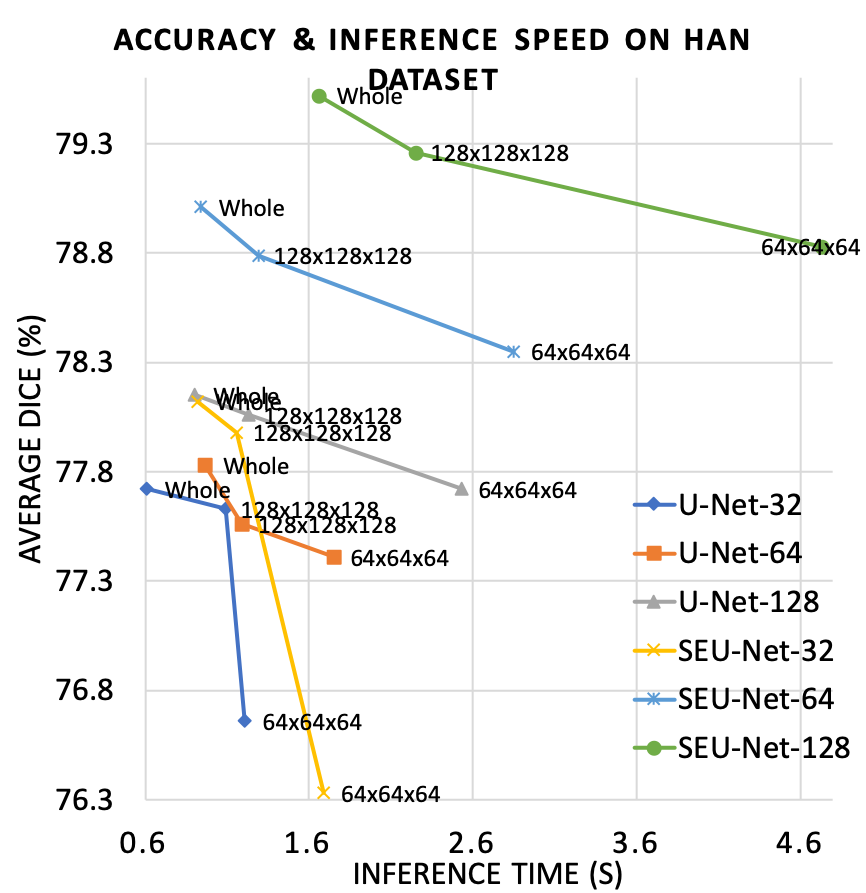

# lamp-automated-model-parallelism
MICCAI20 Early Accepted "LAMP: Large Deep Nets with Automated Model Parallelism for Image Segmentation"

The code is available via https://github.com/Project-MONAI/MONAI/tree/master/research

Deep Learning (DL) models are becoming larger, because the increase in model size might offer significant accuracy gain. To enable the training of large deep networks, data parallelism and model parallelism are two well-known approaches for parallel training. However, data parallelism does not help reduce memory footprint per device. In this work, we introduce Large deep 3D ConvNets with Automated Model Parallelism (LAMP) and investigate the impact of both input's and deep 3D ConvNets' size on segmentation accuracy. Through automated model parallelism, it is feasible to train large deep 3D ConvNets with a large input patch, even the whole image. Extensive experiments demonstrate that, facilitated by the automated model parallelism, the segmentation accuracy can be improved through increasing model size and input context size, and large input yields significant inference speedup compared with sliding window of small patches in the inference.

